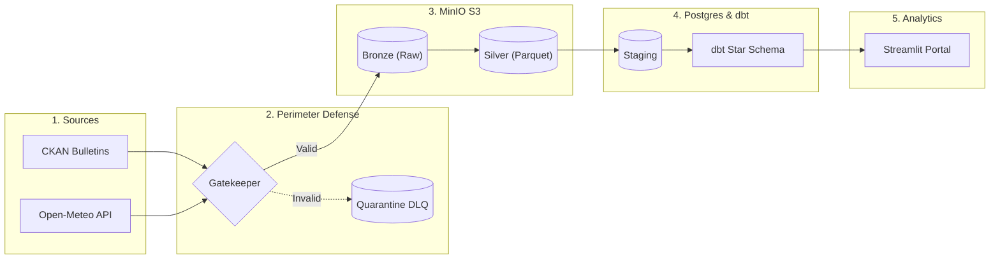

# 🌊 Morocco Tensift Water Reliability Lakehouse & Data Warehouse

[](https://www.python.org/downloads/)
[](https://www.getdbt.com/)
[](https://min.io/)
[](https://www.postgresql.org/)
[](https://airflow.apache.org/)
[](https://streamlit.io/)
[]()

An enterprise-grade, end-to-end **Data Lakehouse and Analytics Engineering Platform** monitoring hydrological stress, daily reservoir reserves, and climate metrics across the **Tensift River Basin** (Marrakech-Safi region, Morocco).

Built following modern Data Engineering principles: **Defensive Ingestion Contracts**, **Medallion Architecture (Bronze / Silver / Gold)**, **Kimball Dimensional Modeling with dbt**, **Apache Airflow Orchestration**, and an interactive **Hydrological Runway Simulator**.

---

## 🏛️ End-to-End System Architecture



---

## 🔑 Key Engineering Highlights

### 1. Defensive Perimeter: Schema Contracts & Quarantine Gatekeeper
Public APIs and government bulletins frequently suffer from upstream drift, formatting errors, or truncated payloads. Our pipeline treats all external data defensively:
- **Cryptographic Fingerprinting**: Calculates the SHA-256 digest of every payload before persistence.
- **Excel Contract Verification**: Validates file integrity, sheet structure, and column presence.
- **JSON Dimensional Integrity**: Enforces that meteorological arrays (`time`, `temperature_2m_max`, `temperature_2m_min`, `precipitation_sum`) have identical lengths before admission.
- **Dead-Letter Queue (DLQ)**: Invalid or malformed files are diverted to `morocco-water-quarantine` with metadata recording the exact failure reason (`quarantine_reason`), preventing downstream pipeline pollution.

### 2. Medallion Storage Architecture (MinIO S3)
- **Bronze Layer (`morocco-water-bronze`)**: Raw, immutable, append-only storage preserving exact upstream payloads with SHA-256 checksums in object metadata.
- **Silver Layer (`morocco-water-silver`)**: Cleaned, standardized columnar files stored as Snappy-compressed **Apache Parquet**:
  - Normalizes French month strings and removes diacritical accents (`Août` → `Aout`).
  - Drops aggregate footer rows by strictly asserting calendar boundaries (`1 <= day <= 31`).
  - Parses French comma decimals into IEEE 754 floating-point numbers.
- **Gold Layer (`morocco-water-gold`)**: Pre-aggregated analytical master Parquet files providing high-performance object storage redundancy.

### 3. Dimensional Modeling with dbt Core (PostgreSQL)
Implements a Kimball-style Star Schema within PostgreSQL:
- **`dim_reservoir`**: Dimension table containing dam metadata, hydrological river basin tags, total storage capacity (Mm³), and deterministic surrogate keys (`MD5(dam_id)`).
- **`dim_date`**: Temporal dimension with integer keys (`YYYYMMDD`), calendar day, month, year, and day of week.
- **`fact_reservoir_daily`**: Daily fact grain containing current reserve volume (Mm³), fill percentage (0% - 100%), and **Daily Drawdown Rate** (ΔV = V_t - V_{t-1}) calculated via SQL window functions (`LAG()`).
- **Automated Data Quality Suite (22 Tests)**:
  - Unique & Not-Null constraints on all surrogate and natural keys.
  - Foreign key referential integrity between fact and dimension tables.
  - Value bounds enforcement (`0 <= fill_pct <= 100`).
  - Singular SQL assertions verifying non-negative reserve volumes.

### 4. Hydrological Stress & Runway Simulator (Streamlit)
Instead of applying fragile machine learning models to short historical time series, the dashboard computes actionable hydrological metrics:
- **Zero-Rain Water Runway ($T_{\text{runway}}$)**: Projects the remaining operational days before each reservoir hits its critical dead-storage threshold (20% capacity) under zero-precipitation conditions:
  $$T_{\text{runway}} = \frac{V_{\text{current}} - V_{\text{critical}}}{\bar{D}_{\text{daily}}}$$
- **Drawdown Trend Analysis**: Tracks daily net depletion rates across the basin.
- **Runoff Lag Cross-Correlation**: Evaluates rainfall-to-inflow response times across mountain catchment areas.

### 5. Orchestration (Apache Airflow)
- Encapsulated in [`dags/morocco_water_lakehouse_dag.py`](dags/morocco_water_lakehouse_dag.py) with automated retries (`retries=2, retry_delay=2m`), SLA monitoring, and dependency branching.
- **Idempotency Guarantee**: Safely rerunnable at any time; staging loaders use a transactional Truncate-and-Append pattern, and Bronze layers use digital fingerprinting.
- **Parallelism**: CKAN extraction and Open-Meteo extraction run concurrently on separate branches.

---

## 📁 Repository Structure

```
.
├── dags/
│   └── morocco_water_lakehouse_dag.py     # Production Apache Airflow DAG
├── dbt_project/
│   ├── dbt_project.yml                    # dbt project configuration
│   ├── profiles.yml                       # PostgreSQL connection profile
│   ├── models/
│   │   ├── staging/                       # Staging views (stg_reservoirs, stg_weather)
│   │   └── marts/                         # Star Schema (dim_reservoir, dim_date, fact_reservoir_daily)
│   └── tests/                             # Custom singular dbt data tests
├── infrastructure/
│   └── docker-compose.yml                 # PostgreSQL, MinIO, and Airflow service definitions
├── src/
│   ├── config/
│   │   └── locations.py                   # Station coordinates and reservoir metadata
│   ├── extraction/
│   │   ├── extract_ck.py                  # CKAN API client with dynamic discovery
│   │   └── weather_client.py              # Open-Meteo multi-coordinate client
│   ├── storage/
│   │   ├── minio_handler.py               # S3 handler with SHA-256 and Quarantine routing
│   │   └── load_silver_to_postgres.py     # Truncate-and-Append PostgreSQL staging loader
│   └── transformations/
│       ├── ckan_silver.py                 # French text normalization & decimal cleaning
│       ├── weather_silver.py              # Weather JSON flattening & Parquet encoding
│       └── gold_aggregation.py            # Deduplication & analytical joins
├── tests/                                 # Pytest suite (18 unit, integration, & DAG tests)
├── app.py                                 # Streamlit dashboard & Hydrological Runway Simulator
├── run_ingestion.py                       # Bronze extraction & quarantine runner
├── run_silver_pipeline.py                 # Silver Parquet transformation runner
├── run_warehouse_pipeline.py              # Postgres loader + dbt runner
├── run_lakehouse_pipeline.py              # Full end-to-end local orchestrator
├── requirements.txt                       # Project Python dependencies
└── README.md                              # Project documentation
```

---

## 🚀 Quickstart Guide

### 1. Prerequisites
- **Python**: 3.11+
- **Docker**: Docker Desktop with Docker Compose

### 2. Environment Setup
Clone the repository and create a virtual environment:
```bash
git clone https://github.com/adammoutik/morocco-water-lakehouse.git
cd morocco-water-lakehouse

python -m venv .venv
# Windows PowerShell:
.\.venv\Scripts\Activate.ps1
# Linux / macOS:
source .venv/bin/activate

pip install -r requirements.txt
```

### 3. Spin Up Infrastructure
Start local PostgreSQL and MinIO containers:
```bash
docker compose -f infrastructure/docker-compose.yml up -d db minio
```
- **MinIO Console**: http://localhost:9001 (Credentials: `minioadmin` / `minioadmin123`)
- **PostgreSQL**: `localhost:5432` (User: `postgres`, Password: `postgres`, DB: `reservoir_db`)

### 4. Run the Full End-to-End Pipeline
Execute all 8 steps in sequence (Extraction → Quarantine → Bronze → Silver → Postgres Staging → dbt Models → dbt Tests → Gold Parquet):
```bash
python run_lakehouse_pipeline.py
```

### 5. Run the Automated Test Suites
Execute unit and DAG integrity tests:
```bash
pytest -v
```
Execute dbt dimensional data tests:
```bash
cd dbt_project
dbt test --profiles-dir .
cd ..
```

### 6. Launch the Streamlit Analytics Portal
```bash
streamlit run app.py
```
Open [http://localhost:8501](http://localhost:8501) in your browser to explore:
- **Basin Overview**: Aggregate storage capacity, current reserves, and live fill rates.
- **Reservoir Profiles**: Historical drawdown rates (ΔV) and elevation curves.
- **Hydrological Stress & Runway Simulator**: Zero-rain depletion timelines and mountain runoff cross-correlation.

---

## 📊 Medallion Data Flow Summary

| Layer | Technology | Primary Entities | Key Transformations |
|---|---|---|---|
| **Perimeter** | Python + Hashlib | SHA-256 Checksums, Quarantine DLQ | Contract validation, array length verification |
| **Bronze** | MinIO (S3) | Raw Excel bulletins, Raw JSON weather | Immutable storage, digital fingerprint metadata |
| **Silver** | MinIO (S3) + Parquet | Cleaned reservoir & weather Parquets | Accent removal, row filter (`1 <= day <= 31`), decimal parsing |
| **Staging** | PostgreSQL | `staging.stg_reservoirs`, `stg_weather` | Truncate-and-Append staging handoff |
| **Gold (Warehouse)** | dbt + PostgreSQL | `dim_reservoir`, `dim_date`, `fact_reservoir_daily` | MD5 surrogate keys, `LAG()` drawdown, 22 dbt assertions |
| **Gold (Storage)** | MinIO (S3) | `water_reliability_master_*.parquet` | Master analytical snapshot for external consumption |
| **Analytics** | Streamlit | Hydrological Runway, Drawdown curves | Zero-rain runway formula, lag cross-correlation |
| **Orchestration** | Apache Airflow | `morocco_tensift_water_lakehouse` DAG | Daily schedule, retries, dependency branching |

---

## 📜 License
This project is licensed under the Apache 2.0 License.
